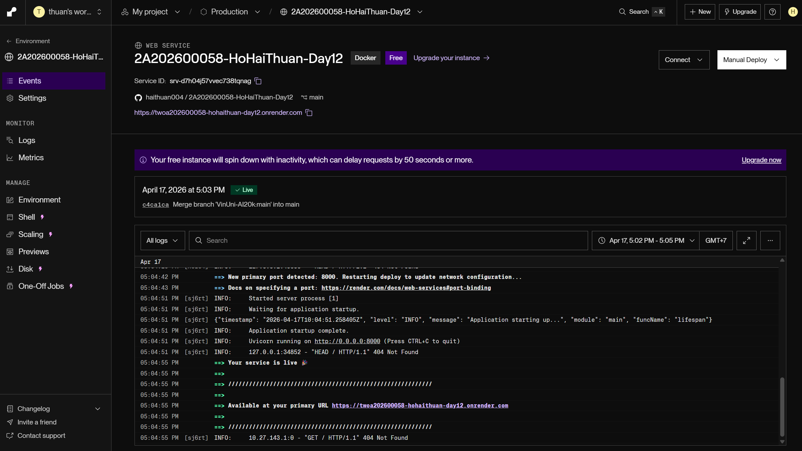
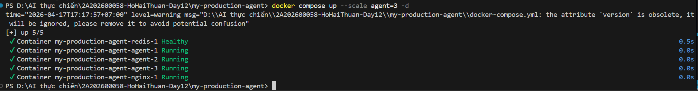
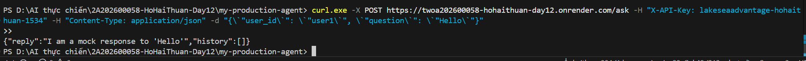

# Deployment Information

## Public URL
https://twoa202600058-hohaithuan-day12.onrender.com

## Platform
Render

## Test Commands

### Health Check
```bash
curl https://twoa202600058-hohaithuan-day12.onrender.com/health
# Expected: {"status": "ok"}
```

### API Test (with authentication)
```bash
curl -X POST https://twoa202600058-hohaithuan-day12.onrender.com/ask \
  -H "X-API-Key: lakeseaadvantage-hohaithuan-1534" \
  -H "Content-Type: application/json" \
  -d '{"user_id": "user1", "question": "Hello"}'
```

## Environment Variables Set
- PORT=8000
- REDIS_URL=redis://red-d7h097naqgkc739ktevg:6379
- AGENT_API_KEY=lakeseaadvantage-hohaithuan-1534
- LOG_LEVEL=INFO
- RATE_LIMIT_PER_MINUTE=10
- MONTHLY_BUDGET_USD=10.0

## Screenshots
- 
- 
- 
